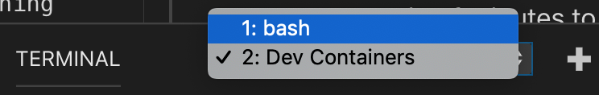
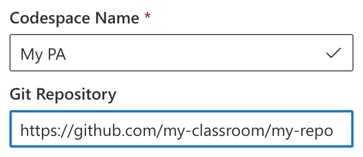

# Project setup

There are four ways of working on the PAs and Projects for this class:

1. Use the ieng6 lab machines.
2. Use a devcontainer on your own computer.
3. Use Visual Studio Codespaces.
4. Configure a programming environment by yourself.

## Getting Started with ieng6

If you don’t want to do any setup, you have the option to remotely connect to the lab machines (a.k.a. ieng6) using ssh or physically work in the lab. No additional setup is necessary for you to do, as the lab computers are already equipped with all the tools that you need. Here’s a step by step guide for you to get started:

**1. Connect to ieng6** (skip this step if you are physically working on a lab machine)
If you’re on a Mac, you can open a terminal and use the command below and enter your password when prompted to connect to ieng6:

`ssh <your_cse_100_account>@ieng6.ucsd.edu`

For windows users, we encourage you to use the super convenient tool MobaXterm.

**2. Get the starter code**
This step is given to you on the write-up, but in summary, you have to clone the starter code repository by running the command below and enter your github username and password when prompted:

`git clone <the-url-provided-in-the-writeup>`

Everything from this point on is the same as what you would do if you were working in a devcontainer, but here’s a concise guide to compiling and running your code.

**3. Compiling your code**
Before trying to compile on ieng6, run the following command to activate a newer compiler:

`source scl_source enable devtoolset-7 llvm-toolset-7`

## Getting Started with the Devcontainer

- ⚠️NOTE: Windows users, when installing Docker it may ask you if you want to configure it for running Windows containers or Linux containers. **Choose Linux containers.**
- ⚠️NOTE: Windows users, if you are running Windows Home-edition, please upgrade for free to [Windows Education-edition](https://ucsd.onthehub.com/WebStore/OfferingDetails.aspx?o=9b3bfdc0-71e9-e611-9425-b8ca3a5db7a1) before continuing. (Docker Desktop for Windows requires the Hyper-V Windows feature which is not available on Home-edition.)
- Download and install Docker Desktop: https://www.docker.com/products/docker-desktop
- Make sure docker is running
- Download and install VSCode
- Open VSCode, click the "Extensions" icon on the left and install the "Remote Development" extension by Microsoft

- Open this project in VSCode
- There will be a popup asking if you want to open it in a devcontainer:

- Click "Reopen in Container"
- If you don't see the popup, you can also open the devcontainer with a command.
  - open the Command Palette in VSCode: `ctrl+shift+p` (`cmd+shift+p on mac`)
  - type "reopen" and hit enter
  
- The first time you are opening the devcontainer it will take a couple of minutes to install. But if you reopen it again at a later moment it should only take a matter of seconds.
- Once the devcontainer is up and running you'll see the files in your project reappear on the left
- Open bash in the VSCode Terminal tab:

  - ℹ️If you don't see a TERMINAL tab in the bottom panel of your screen, hit ``ctrl+` ``
  - ℹ️If you don't see a "Bash" option in the dropdown, click the plus icon to the right of the dropdown
- Cool, now you are fully set up to begin developing on the project!

## Getting Started with Visual Studio Codespaces

Codespaces are virtual programming environments that run in the cloud. You can access them through your browser.

First, sign up for Azure for Students: https://azure.microsoft.com/en-us/offers/ms-azr-0170p/

The Azure for Students program will give you $100 worth of free Azure credit that is valid for 12 months. This should be more than enough for you to complete all the programming assignments and projects of this course.

To create the Codespace go here: https://online.visualstudio.com/.  
Make sure to add the url to your personal starter code in the Git Repository field.

When you click `Auth & Create` you will be prompted to log in to your Github account to give the Codespace access to your github repo.

After logging in, your Codespace will be created.

## Configuring a programming environment by yourself

Take a look at the github repository linked in the DockerHub repository for the image used in the `devcontainer.json` file to see what programs you may need to install:

https://hub.docker.com/repository/docker/sandervalstar/devcontainer

Here is a summary of the minimum required programs for the projects:

- g++
- make
- cmake
- gdb (for debugging)
- valgrind (for memory leak analysis)
- python
- lxml (can be installed through pip, for generating the coverage report)
- lcov (with an L not I, for generating the coverage report)
- clang-format (for the auto formatter)

Having the following tools will be handy for the Projects as well:

- cppcheck (static code analysis, helps identify possible bugs)
- scan-build (static code analysis, helps identify possible bugs)
- xxd or hexdump (for comparing binary files)
